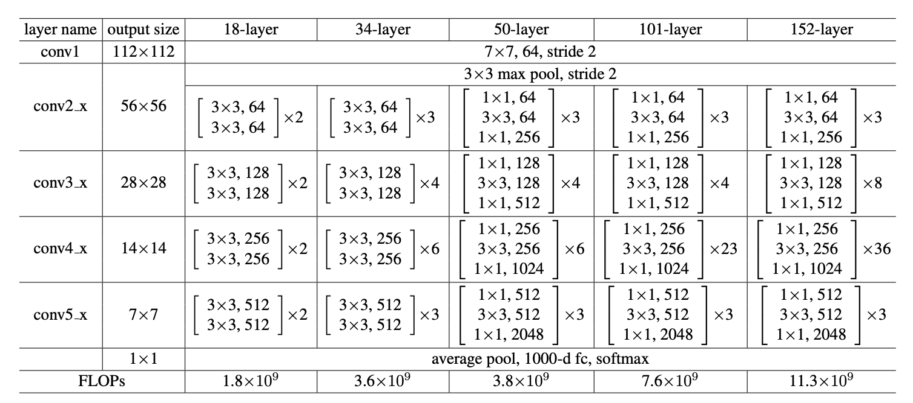

# Classical_Models
This is the project to build classical deep learning models for research purpose.

# ResNet: make deeper network easier to train.
ResNet implicitly adds the input to the output of the group of layers. This action promises that the output will work at least as an identical layer.
## Problems Review
Deep networks are suffering from multiple obstacles. Although gradient vanishing/exploding problems can be solved by proper initialization and normalization techniques, the accuracy won't increase along with the depth of the network gradually. Such **degradation** problem is not caused by overfitting because the training error is also higher than shallower network. 

Instead of setting the layers to learn the underlying features directly, we explicitly let the layers to learn the residual part of the features. **It means that, we want the layers to learn the differences between the last layer.**

Because of the identical connection, the deeper model should have training error no greater than shallower counterpart.

The most important assumption here is that, **the optimal function is closer to a identify mapping rather than a zero mapping**. Based on the assumption, we can train the blocks to find the difference effciently. This assumption was illustrated by experiments in the original paper.

## Advantages
There are two main advantanges for ResNet:

1. There is no extra parameters introduced.
2. There is no computation complexity added(for most of the connections.).

## Network Architecture
### Basic Building Block
The basic building block of ResNet is shown below. The output of this block is the sum of two parts: the identical output from previous block and the residual part learnt from present block. 

In this way, if the blocks prefer to have an identical value, it can simply push the weights to 0. The shortcut connection is just the identity mapping. **There is no extra parameters introduced.**

<b><i>

ResNet Building Block
</i></b>

The shortcut connection also benefits the flow of back propagation. Because the node is an add gate, **the gradient of the identity X is simply "1".** That means the gradient from next block will be directly passed to the last block at least. Thus the gradient vanishing problem can be retard.

**The output has the same dimensionality as the input** so that X can be added to F(X) directly. If not, we use 0 padding method or use 1*1 filters with stride 2 to reshape the input X.

### Parameters and Layer Shapes
The structures shown in the original paper is pasted below. 

<b><i>

ResNet Structure Table
</i></b>

There are always 5 layer groups for each model. 

#### Stride
Stride is always 1 except for the first layer in 2nd~5th groups. Downsampling is performed there so the stride is set to 2. The input X is also modified by 1*1 filter with stride 2.

#### Padding
Zero paddings is always used to keep the dimension right except for the downsampling layer. Because stride is 1, padding is also 1.

#### Initialization
Here we use the method called "MSRA" initialization because we use ReLu as our activation. Details can be found at this link: [MSRA for tensorflow](https://www.tensorflow.org/api_docs/python/tf/contrib/layers/variance_scaling_initializer)

As for the bias, it is always 0 at the begining.

Batch Normalization is also used **before the activation function**, the parameters for it is chosen to be default value.
#### Learning Rate and SGD with Momentum
Learning Rate starts from 0.1 and will be divided by 10 when saturated.

Weight decay is 0.0001 and momentum is 0.9.