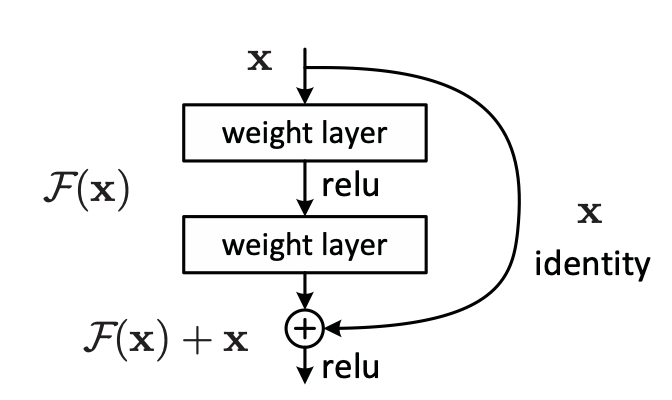

# Classical_Models
This is the project to build classical deep learning models for research purpose.

# ResNet: make deeper network easier to train.
ResNet implicitly adds the input to the output of the group of layers. This action promises that the output will work at least as an identical layer.
## Problems Review
Deep networks are suffering from multiple obstacles. Although gradient vanishing/exploding problems can be solved by proper initialization and normalization techniques, the accuracy won't increase along with the depth of the network gradually. Such **degradation** problem is not caused by overfitting because the training error is also higher than shallower network. 

Instead of setting the layers to learn the underlying features directly, we explicitly let the layers to learn the residual part of the features. **It means that, we want the layers to learn the differences between the last layer.**

## Network Architecture
### Basic Building Block
The basic building block of ResNet is shown below. The output of this block is the sum of two parts: the identical output from previous block and the residual part learnt from present block. 

In this way, if the blocks prefer to have an identical value, it can simply push the weights to 0. The shortcut connection is just the identity mapping. **There is no extra parameters introduced.**

<b><i>

ResNet Building Block
</i></b>

The shortcut connection also benefits the flow of back propagation. Because the node is an add gate, **the gradient of the identity X is simply "1".** That means the gradient from next block will be directly passed to the last block at least. Thus the gradient vanishing problem can be retard.

